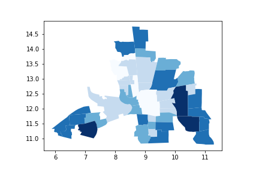

# Spatial Data Science with PySAL @GeoComputation19

### Instructor

- [Sergio Rey](http://sergerey.org) - Center for Geospatial Sciences, University of California, Riverside

---

This repository contains the materials and instructions for the PySAL workshop at [GeComputation 2019](https://www.otago.ac.nz/geocomputation/call-for-papers/index.html).


## Schedule


* 8:00-10:00
  * Overview of PySAL and workshop
  * Introductions
  * Setup
  * Jupyter notebooks
  * Python primer
* 10:00-10:30
  * Coffee Break
* 10:30-12:30
  * Spatial data processing
  * Choropleth mapping and geovisualization
  * Spatial weights
* 12:30-1:30
  * Lunch
* 1:30-3:00
  * Global spatial autocorrelation
  * Local spatial autocorrelation
  * Spatial inequality analysis
* 3:00-3:30
  * Coffee Break  
* 3:30-5:00
  * Geodemographics and regionalization
  * Spatial dynamics
  * Spatial regression
  
## Setup

Participants are encouraged to use their own laptops during the workshop. Setting up a laptop for the workshop consists of two steps:

1. Obtaining the workshop materials
2. Installing Python and required packages
  
### Obtaining Workshop Materials

If you are familiar with GitHub, you should clone or fork this GitHub repository to a specific directory. Cloning can be done by:

```bash
git clone https://github.com/sjsrey/geocomputation19.git
```

If you are not using git, you can grab the workshop materials as a zip file by pointing your browser to (https://github.com/sjsrey/geocomputation19.git) and then:

1. Click on the green *Clone or download* button in the upper right
2. Select the `Download Zip` link


This will download the file `pysalworkshop-master.zip` to your downloads directory.  

Once you have downloaded the zip file, extract the archive to a working directory of your choosing. The archive will expand into the directory `pysalworkshop-master`.  

### Software Installation

We will be using a number of Python packages for geospatial analysis.


An easy way to install all of these packages is to use a Python distribution
such as [Anaconda](https://www.anaconda.com/download/#macos). In this workshop
we will use anaconda to build an
[environment](https://conda.io/docs/user-guide/tasks/manage-environments.html)
for **Python 3**. 

- [Windows Anaconda installation instructions](https://docs.anaconda.com/anaconda/install/windows/#)
- [macOS Annaconda installation instructions](https://docs.anaconda.com/anaconda/install/mac-os/#)
- [Linux Anaconda installation instructions](https://docs.anaconda.com/anaconda/install/linux/#)


Once you have installed Anaconda, you can explore the options for interacting with Python through Anaconda: [Getting started with Anaconda](https://docs.anaconda.com/anaconda/user-guide/getting-started/#open-nav-win).

All our work will begin from an [Anaconda prompt](https://docs.anaconda.com/anaconda/user-guide/getting-started/#write-a-python-program-using-anaconda-prompt-or-terminal).

Having read the [Ananconda prompt](https://docs.anaconda.com/anaconda/user-guide/getting-started/#write-a-python-program-using-anaconda-prompt-or-terminal) instructions, start a prompt and
 navigate to the working directory where you extracted the archive in the
*Obtaining Workshop Materials* section above.

For example, if you are on Windows and your user name is `MyName`, and you extracted the archive to:
`C:\Users\MyName\Downloads\pysalworkshop-master` 

then at the Anaconda prompt you would get there with:

```bash
cd C:\Users\MyName\Downloads\pysalworkshop-master
```

Were you instead on macOS you would do:

```bash
cd /Users/MyName/Downloads/pysalworkshop-master
```

Once there, create the workshop environment with:

```bash
conda-env create -f pysalworkshop.yml
```

This will build a conda python 3+ environment that sandboxes the installation of the required packages for this workshop so we don't break anything in your computer's system Python (if it has one).

This may take 10-15 minutes to complete depending on the speed of your network connection.

Once this completes, you can activate the workshop environment:

* on Mac, Linux:
```bash
source activate pysalworkshop
```
* on Windows:
```bash
activate pysalworkshop
```

Next, you will want to test your installation with:
```bash
 jupyter-nbconvert --execute --ExecutePreprocessor.timeout=120 check_workshop.ipynb
```

You should see something like:
```bash
[NbConvertApp] Converting notebook check_workshop.ipynb to html
[NbConvertApp] Executing notebook with kernel: python3
[NbConvertApp] Writing 347535 bytes to check_workshop.html
```

Open check_workshop.html in a browser, and scroll all the way down, you should see something like:


You should also see a new file in the current directory called `inc.png` that contains a map looking something line:



If you do see the above, you are ready for the tutorial. If not, please contact me at sjsrey@gmail.com

## Troubleshooting


If you encounter the following error when starting jupyterlab:
```bash
FileNotFoundError: [WinError 2] The system cannot find the file specified
```
A solution is to issue the following command in the anaconda prompt:
```bash
 python -m ipykernel install --user
```

